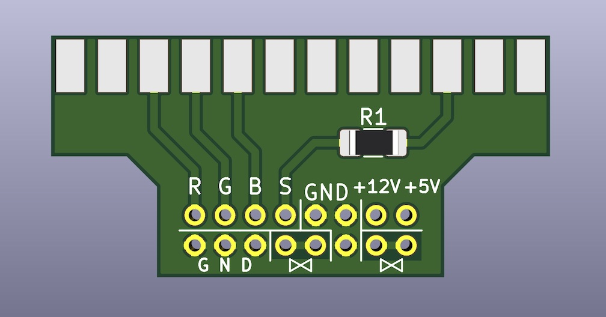
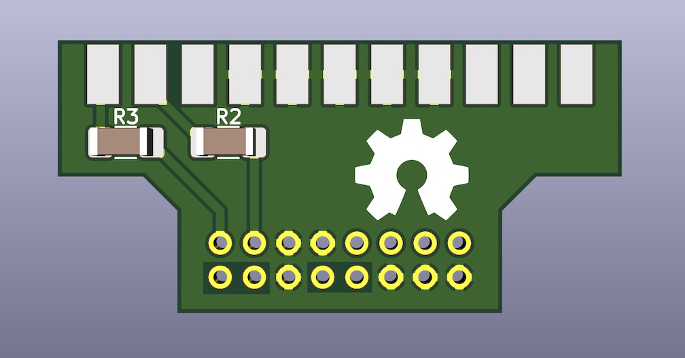
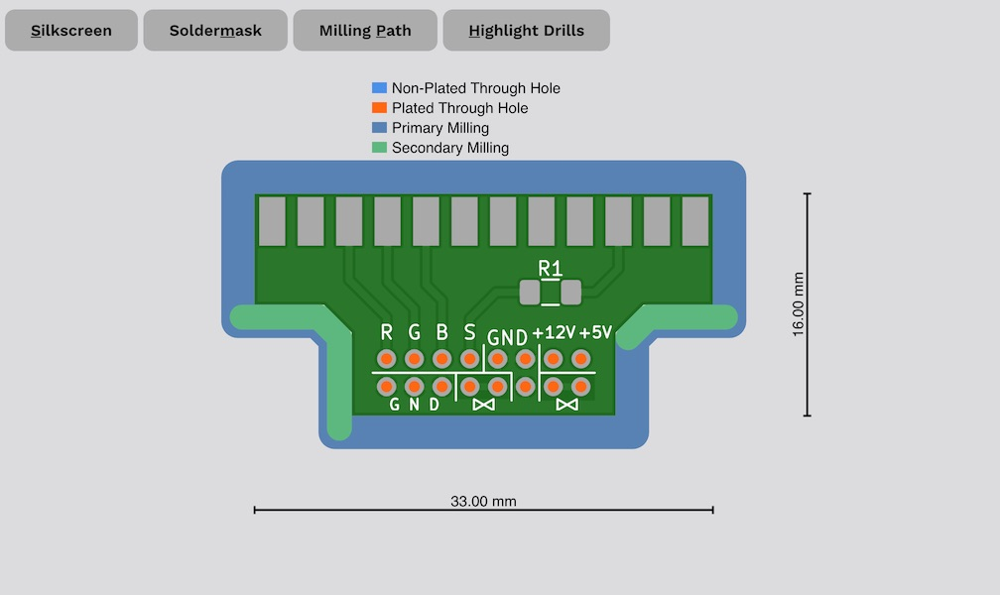
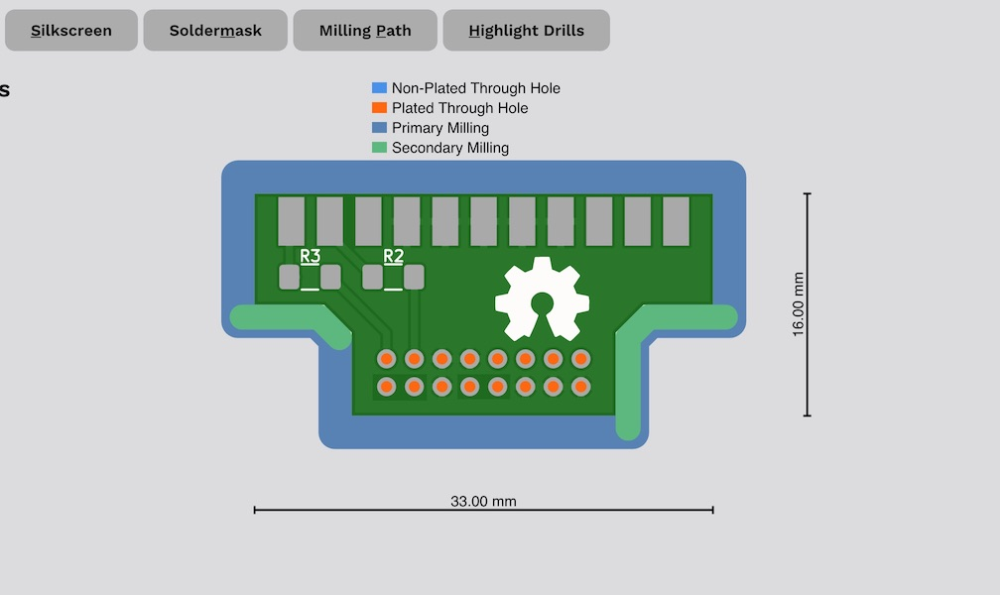
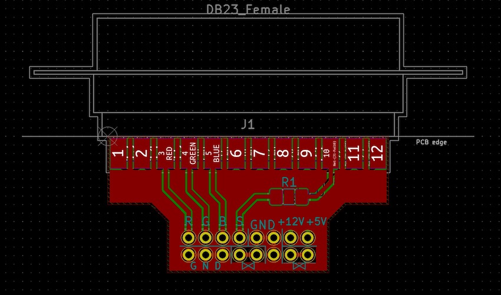
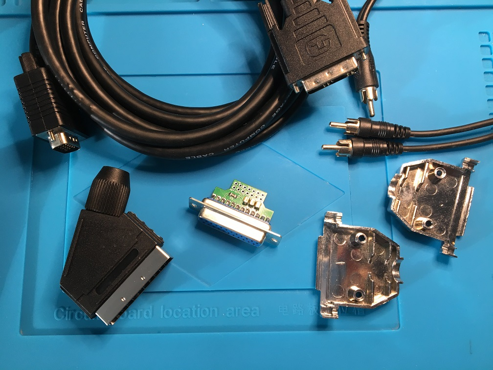

# Amiga_DB23_RGBS
A small PCB with RGBS out from the Amiga d-sub db23 connector. Made with KiCad 5.1.2-1

### Updated v2 PCB

On request I made an updated PCB with the capacitor pads removed, 2 mm hole pitch giving two more GND holes. A little rerouting as well to provide for easier soldering when using cables with shielded wire pairs (signal + ground return). This PCB is not tested yet!

***

Update: On some cables I got a lot of noise/interference in the signal and needed to connect the shielding on the plugs on each end `d-sub metal shield <-> SCART metal shield` to get rid of it.

***

***

***

Let's solder this one. I used `220uF 16V size 1210` as coupling capacitors for the RGB pads. All resistors `size 1206`, I used the following values `R1: 330 Ohm, R2: 1K Ohm, R3: 75 Ohm`, following Stedy's guide here: The Ultimate SCART cable v1.1 http://www.ianstedman.co.uk/Amiga/amiga_hacks/Amiga_SCART/amiga_scart.html Not using pin 13 though as ground return but rather following this picture: https://ilesj.files.wordpress.com/2012/01/amiga_rgb-scart-diagram.png

***
I used an old DVI<->Vga cable that I butchered cutting off the plugs on both ends. I also found an old composite rca cable yellow-red-white laying around. I used the red-white part for the Audio. When making a cable with a SCART plug it makes sense to run the Left/Right audio wires inside the cable since the connector has both RGB video and stereo audio pins as standard. You can run the audio wires separately should you want to.

  
I started with soldering the audio wires to the extension sides, holes with the "interconnected" symbol.
 

***

And then the rest, I used the three shielded wires for the RGB lines.

***

Moment of truth, hooking it up to the Amiga and yes it does work...I noticed I get more subtle vertical stripes with this cable then other Scart's I have tried, However I can still notice some "jailbars", check the last picture here from the game Another World. This is on my old Samsung LCD from 2005 that has seen better days. It is better on my plasma.

***

